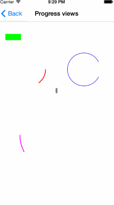
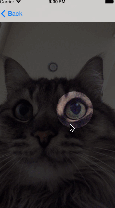
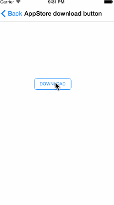
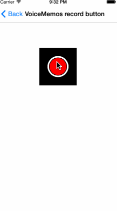

 &nbsp; 
 &nbsp; 


Shapes is a set of wrappers around CAShapeLayer and UIBezierPath, that allows drawing and animating geometrically shaped views on iOS. Read more about it on the blog: http://mlsdev.com/blog/23







### Shaped views

`DTShapeView` is a UIView subclass, that is backed by CAShapeLayer instead of CALayer. It provides API for changing CAShapeLayer path, fill and stroke colors and other layer properties, basically allowing UIView to behave like geometric shape.

All `DTShapeView` properties are automatically converted to CAShapeLayer properties or use CAShapeLayer properties directly. You can use whatever style you like, but we recommend using UIBezierPath and `DTShapeView` properties, because this allows you to completely bypass CoreFoundation objects. It also allows you to use CoreGraphics API instead of QuartzCore.

`DTShapeView` fully supports both explicit and implicit animation and hit testing inside it's path.

### Progress views 

`DTProgressView` is a `DTShapeView` subclass, that allow animating progress views of any shape. `DTProgressView` uses `DTShapeView` path as track.

By default, `DTProgressView` fills entire view bounds, filling view from left to right. And all you need to create a progress view, is drop it onto your view, set strokeColor and your progress view is ready!

```objective-c
self.simpleProgressView.strokeColor = [UIColor greenColor];
```

Whenever your progress changes, simply call 

```objective-c
[self.simpleProgressView setProgress:progress animated:YES];
```

And progress change will be animated. `DTProgressView` supports any geometric shape UIBezierPath can define, and allows customizing animation duration and animation function.

### Dimming views

`DTDimmingView` allows dimming part of the view, by "cutting" visible path from it. By default, dimming path contains entire UIView bounds. Create UIBezierPath, that describes, which part of the view should be visible, and set it on `DTDimmingView` instance to allow content to be seen.

```objective-c
    UIBezierPath * roundedPath = [UIBezierPath bezierPathWithOvalInRect:CGRectInset(self.view.bounds, 100, 100)];
    self.dimmingDynamicView.visiblePath = roundedPath;
```

### Shaped buttons

`DTShapeButton` is a UIButton, that has `DTShapedView` added as a subview. As a result, it allows manipulating UIButton shape and visual appearance by changing `DTShapedView` properties. By default, button shape is a rectangle with UIButton bounds set as it's frame. For example, drawing initial state of AppStore download button looks like this:

```objective-c
self.downloadButton.shape.path = [UIBezierPath bezierPathWithRoundedRect:self.downloadButton.bounds cornerRadius:5.0f];
```

To find out more about how animating between shapes works, read [Animatable buttons with Shapes tutorial](https://github.com/DenHeadless/Shapes/wiki/Building-animatable-buttons-with-Shapes)

## Examples

Take a look at example project, provided in ShapesExample folder.

## Requirements

* iOS 7,8 
* ARC
* XCode 6 and iOS 8 SDK

## Installation

Using CocoaPods:
```bash
pod 'Shapes', '~> 1.0.0'
```
